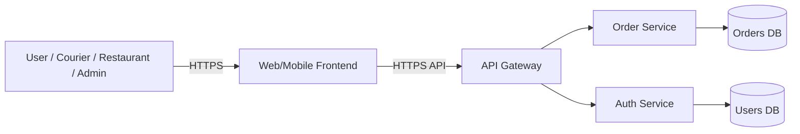

# TM_example_minimal – Требования + Модель угроз + ADR (пример «минимум на 1»)

> Пример для ориентира: как может выглядеть заполненный TM на базовый уровень.  
> Сервис вымышленный, домен упрощён.

---

## 0) Мета

- **65Проект (опционально BYO):** Учебный сервис онлайн-заказа еды «FoodGo» (учебный шаблон)
- **Версия (commit/date):** abc123 / 2025-11-22
- **Кратко (1-2 предложения):** Пользователь заказывает еду в мобильном/веб-приложении, заказы попадают в backend, ресторан и курьер видят актуальные заказы через личный кабинет.

---

## 1) Архитектура и границы доверия (TM1, S04)

- **Роли:**
  - Покупатель (user) – оформляет заказ, видит историю.
  - Оператор ресторана (restaurant) – принимает/отклоняет заказы.
  - Курьер (courier) – видит заказы на доставку.
  - Администратор (admin) – управляет пользователями и меню.

- **Активы:**
  - Профили пользователей (ФИО, телефон, адрес доставки).
  - Заказы (состав заказа, цена, статус).
  - Данные авторизации (логин, хэш пароля, токены сессий).
  - Технические логи и события аудита.

- **Зоны доверия:**
  - **Internet** – клиенты (браузер/мобильное приложение).
  - **DMZ** – frontend/API-gateway.
  - **Internal** – backend-сервисы и БД.

- **Context/DFD (упрощённо):**

- **Критичные интерфейсы и допущения (кратко):**

  - Все внешние запросы идут только через HTTPS к `FE`/`GW`.
  - Доступ к `DB`/`UDB` только из внутренней сети (Internal).
  - Админский интерфейс доступен по отдельному урлу и только с авторизацией.

---

## 2) Реестр угроз STRIDE (TM2, TM3, S04)

*Основные угрозы по STRIDE для ключевых компонентов/потоков.*

| ID  | STRIDE | Компонент/поток    | Угроза (кратко)                                                  | L | I | L×I |
| --- | ------ | ------------------ | ---------------------------------------------------------------- | - | - | --- |
| T01 | **S**  | FE → GW / Auth     | Подмена пользователя украденным токеном (ошибка хранения/логаут) | 3 | 5 | 15  |
| T02 | **T**  | GW → S1            | Повторный запрос (replay) на создание заказа                     | 2 | 4 | 8   |
| T03 | **R**  | Audit / Logs       | Нельзя доказать, кто изменил статус заказа                       | 3 | 3 | 9   |
| T04 | **I**  | FE → GW → S1/DB    | Инъекции через поля заказа/адреса (SQL/NoSQL/шаблоны)            | 2 | 5 | 10  |
| T05 | **D**  | FE → GW / S1       | Массовые запросы, DoS без лимитов и таймаутов                    | 4 | 4 | 16  |
| T06 | **E**  | Repo / Config / CI | Секреты (ключи/пароли) попали в git-репозиторий или логи CI      | 2 | 5 | 10  |

---

## 3) Приоритизация и Top-5 (TM3, S04)

Оценки L и I брались по шкале 1-5, L×I – ориентир для приоритета.

Top-5 рисков:

1. **T05 – DoS без лимитов/таймаутов (L×I=16)**
   Может положить публичный API и полностью остановить приём заказов.

2. **T01 – Подмена пользователя токеном (L×I=15)**
   Доступ к чужим заказам и профилю, возможен заказ за чужой счёт.

3. **T04 – Инъекции через поля заказа (L×I=10)**
   Риск компрометации БД заказов/пользователей.

4. **T06 – Секреты в репозитории/логах (L×I=10)**
   При утечке репозитория возможен доступ к БД и внешним сервисам.

5. **T03 – Отказ от действий (L×I=9)**
   При спорных операциях и инцидентах сложно восстановить, кто что делал.

---

## 4) Требования (S03) и ADR-решения (S05) под Top-5 (TM4)

### NFR-1. Безопасная аутентификация и управление токенами

- **AC (Given-When-Then):**

  - **Given** корректный токен авторизации пользователя,
    **When** он делает запрос к `/api/orders/my`,
    **Then** backend возвращает только его заказы с HTTP 200.
  - **Given** просроченный или поддельный токен,
    **When** выполняется любой запрос к `/api/*`,
    **Then** возвращается HTTP 401 и событие `auth.invalid_token` попадает в аудит.

*Покрывает T01.*

---

### NFR-2. Валидация входных данных и защита от инъекций

- **AC (Given-When-Then):**

  - **Given** заказ с полем «адрес» длиной > 256 символов,
    **When** запрос попадает на `/api/orders/create`,
    **Then** сервис возвращает 400 с текстом об ошибке валидации.
  - **Given** в поле «комментарий» передан опасный шаблон/SQL-фрагмент,
    **When** запрос сохраняется в БД,
    **Then** он обрабатывается как обычная строка (нет ошибок БД, нет выполнения кода).

*Покрывает T04.*

---

### NFR-3. Лимиты и таймауты для публичных API

- **AC (Given-When-Then):**

  - **Given** пользователь делает > N запросов/сек на `/api/orders/create`,
    **When** превышение лимита фиксируется,
    **Then** часть запросов получает 429, сервис остаётся доступен другим пользователям.
  - **Given** backend не отвечает дольше T секунд,
    **When** пользователь делает запрос к API,
    **Then** соединение обрывается по таймауту, фиксируется событие `timeout` в логах.

*Покрывает T05.*

---

### NFR-4. Базовый аудит критических операций

- **AC (Given-When-Then):**

  - **Given** авторизованный пользователь меняет статус заказа,
    **When** запрос успешно выполняется,
    **Then** в логе/аудите есть запись с временем, user_id, order_id и новым статусом.
  - **Given** админ меняет роль пользователя,
    **When** операция завершается,
    **Then** в аудите есть запись `admin.role_change` с user_id и старой/новой ролью.

*Покрывает T03.*

---

### ADR-001 – Токенная аутентификация через Auth Service

- **Context (угрозы/NFR):**
  T01, T03; NFR-1, NFR-4. Нужна однозначная привязка запросов к пользователю и базовый аудит.
- **Decision:**
  Используем короткоживущие JWT-токены, подписанные ключом Auth Service;
  токен проверяется на входе в GW, в прокси добавляется `X-User-Id`;
  логаут реализуется через blacklist/rotation; действия пишутся в аудит.
- **Trade-offs (кратко):**
  Токены нужно ротировать, нужно бережно относиться к ключам подписи.
- **DoD (готовность):**
  Для защищённых endpoint’ов все запросы с просроченным/поддельным токеном дают 401,
  в аудит попадает событие `auth.invalid_token`.
- **Owner:** Team backend.
- **Evidence (план/факт):**
  План: отчёт DAST по auth-flow и образец аудита → `EVIDENCE/TM/auth-audit-sample.txt`.

---

### ADR-002 – Rate limiting и таймауты на уровне API Gateway

- **Context:**
  T05; NFR-3. Публичные API могут быть завалены массовыми запросами.
- **Decision:**
  В `GW` включаем rate-limit на пользователя и IP;
  выставляем таймауты к backend-сервисам и возвращаем 429/504 при превышении.
- **Trade-offs:**
  При агрессивных лимитах часть законных запросов может получать 429.
- **DoD:**
  При нагрузочном тесте >N rps/uid часть запросов получает 429, p95 ответа не выходит за T секунд.
- **Owner:** Team platform.
- **Evidence (план/факт):**
  План: скрин/отчёт нагрузочного теста → `EVIDENCE/TM/loadtest-basic.png`.

---

## 5) Трассировка Threat → NFR → ADR → (План)Проверки (TM5)

| Threat | NFR   | ADR     | Чем проверяем (план/факт)                                                                        |
| ------ | ----- | ------- | ------------------------------------------------------------------------------------------------ |
| T01    | NFR-1 | ADR-001 | DAST auth-flow + sample аудита → `EVIDENCE/TM/auth-audit-sample.txt`                             |
| T03    | NFR-4 | ADR-001 | Анализ записей аудита для изменения статуса заказов → `EVIDENCE/TM/audit-orders.txt`             |
| T04    | NFR-2 | –       | SAST/линтер на инъекции + ручные негативные тесты → `EVIDENCE/TM/sast-sample.txt`                |
| T05    | NFR-3 | ADR-002 | Нагрузочный тест с проверкой 429/таймаутов → `EVIDENCE/TM/loadtest-basic.png`                    |
| T06    | –     | –       | Проверка репозитория на секреты (secrets scan), контроль `.env` → `EVIDENCE/TM/secrets-scan.txt` |

---

## 6) План проверок (мост в DV/DS)

- **SAST/Secrets/SCA:**

  - Запустить линтер/анализатор кода для поиска инъекций и утечек секретов.
  - Отчёты сохранить в `EVIDENCE/TM/sast-sample.txt`, `EVIDENCE/TM/secrets-scan.txt`.
  - Позже эти же инструменты будут использоваться и в DS.

- **SBOM/SCA:**

  - Сгенерировать SBOM по зависимостям backend-сервиса.
  - Отчёт положить в `EVIDENCE/TM/sbom-initial.json`.
  - Позже доработать и привязать к DS.

- **DAST (auth-flow и базовые сценарии):**

  - Прогнать лёгкий профиль DAST по auth и основным endpoint’ам заказов.
  - Сохранить отчёт в `EVIDENCE/TM/dast-auth-basic.html`.

На этапе TM достаточно плана и примеров имён файлов; полные отчёты появятся после DV/DS.

---

## 7) Самопроверка по рубрике TM (0/1/2)

> Пример оценки для этого файла (как базового):

- **TM1. Архитектура и границы доверия:** [ ] 0 [x] 1 [ ] 2
- **TM2. Покрытие STRIDE и уместность угроз:** [ ] 0 [x] 1 [ ] 2
- **TM3. Приоритизация и Top-5:** [ ] 0 [x] 1 [ ] 2
- **TM4. NFR + ADR под Top-5:** [ ] 0 [x] 1 [ ] 2
- **TM5. Трассировка → (план)проверок:** [ ] 0 [x] 1 [ ] 2

**Итог TM (сумма, пример):** 5/10
